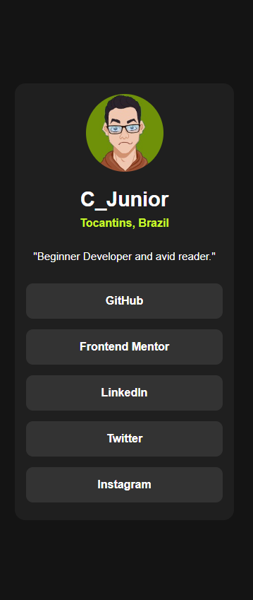
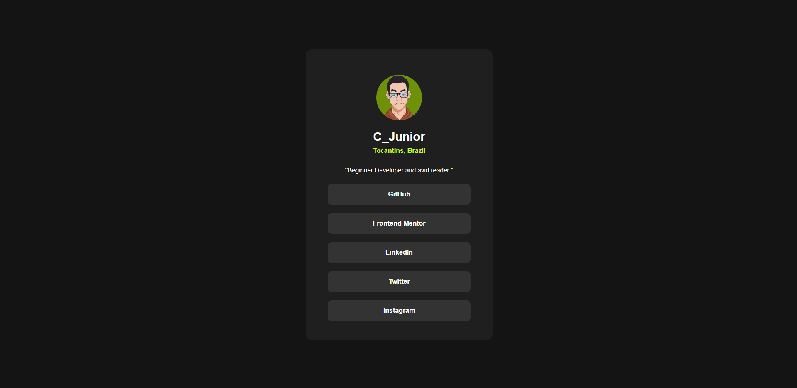

# Frontend Mentor - Social links profile solution

This is a solution to the [Social links profile challenge on Frontend Mentor](https://www.frontendmentor.io/challenges/social-links-profile-UG32l9m6dQ). Frontend Mentor challenges help you improve your coding skills by building realistic projects.

## Table of contents

- [Overview](#overview)
  - [The challenge](#the-challenge)
  - [Screenshot](#screenshots)
  - [Links](#links)
- [My process](#my-process)
  - [Built with](#built-with)
  - [What I learned](#what-i-learned)
  - [Continued development](#continued-development)
  - [Useful resources](#useful-resources)
- [Author](#author)
- [Acknowledgments](#acknowledgments)

**Note: Delete this note and update the table of contents based on what sections you keep.**

## Overview

### The challenge

Users should be able to:

- See hover and focus states for all interactive elements on the page

### Screenshots




### Links

- Solution URL: [Responsivity](https://www.w3schools.com/cssref/css3_pr_mediaquery.php)

## My process

- Mobile first driven development

### Built with

- Semantic HTML5 markup
- CSS custom properties
- Flexbox
- Mobile-first workflow

### What I learned

I learnt a little more about to adjust responsive screen throught CSS @media queries.

```
@media screen and (min-width: 1440px) {
        
}
```

Slowly I'm learnign how to document projects.

### Continued development

- Responsivity
- Flexbox
- CSS Grid
- React
- Sass
- Bootstrap

### Useful resources

-[w3schools](https://www.w3schools.com/) - This site is useful to verify explains and examples.

-[Mozilla Developers Network](https://developer.mozilla.org/pt-BR/) - This is one of best places to resolve doubts, a little complex but very intertesting.

## Author

- Frontend Mentor - [@Clar-Junior](https://www.frontendmentor.io/profile/Clar-Junior)
- GitHub - [@Clar-Junior](https://github.com/Clar-Junior)
